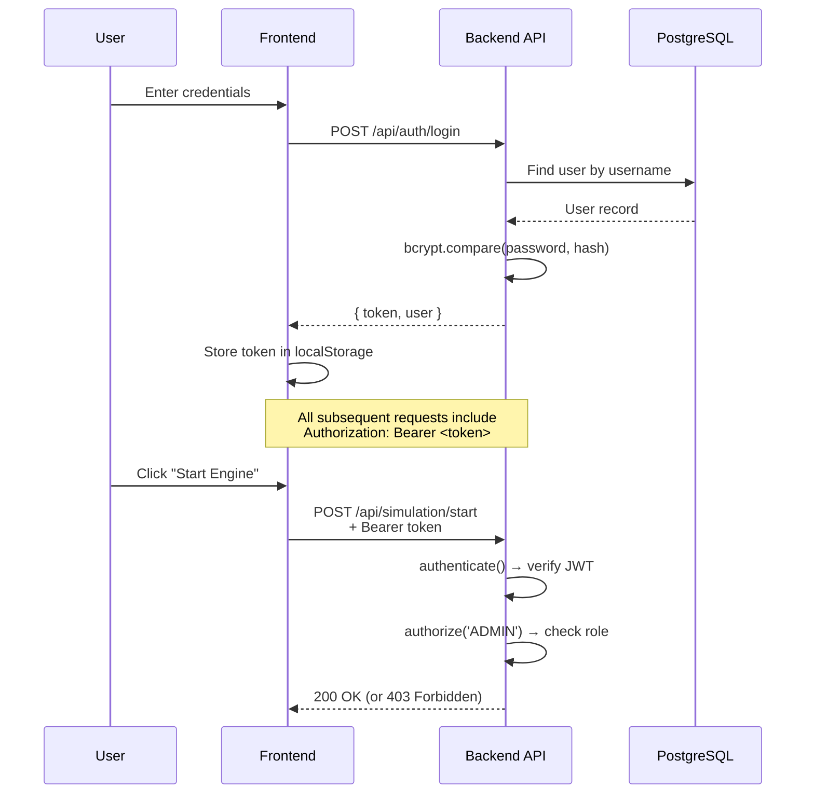

# Authentication System for Traffic Control Center

## Problem

Currently, **anyone** who can access the application can:
- Start/stop/reset the simulation engine
- Switch between Manual and Adaptive AI modes
- Change arrival rates and sim speed
- Create, modify, and delete traffic signals (Config page)

In a real-world traffic control center, only **authorized operators** should be able to modify the system. Observers (city officials, analysts) should be able to view dashboards and analytics but never touch controls.

## Proposed Approach: JWT + Role-Based Access Control (RBAC)

Self-contained auth using **JSON Web Tokens** — no third-party OAuth services needed. This keeps the system fully offline-capable, which matters for critical infrastructure like traffic control.

### Two Roles

| Role | Can Do | Cannot Do |
|---|---|---|
| **Admin** (Operator) | Everything — start/stop engine, change mode, config signals, view dashboards | — |
| **Viewer** (Observer) | View dashboard, history, analytics | Any mutation — controls are hidden/disabled |

### Why JWT over Sessions?

- **Stateless** — backend doesn't need to track sessions in memory or DB
- **WebSocket friendly** — token is sent once on connection, validated server-side
- **Simple** — no Redis/session store dependency needed
- **Standard** — widely understood, easy to audit for your 3rd year project write-up

---

## User Review Required

> [!IMPORTANT]
> **Default Admin Account**: The plan seeds a single admin user (`admin` / `admin123`). You should change this password immediately after first login. Should I also add a "change password" feature?

> [!IMPORTANT]
> **Viewer Registration**: Should viewers be able to self-register, or should only an admin be able to create new viewer accounts? The current plan assumes **admin-only account creation** (more secure for infrastructure).

> [!IMPORTANT]
> **Session Duration**: The plan uses a **24-hour JWT expiry**. Is that suitable, or would you prefer shorter (e.g., 8-hour shift) or longer?

---

## Proposed Changes

### Database

#### [MODIFY] [schema.sql](file:///home/gravirei/Documents/Projects/3rd_year_project/backend/database/schema.sql)
Add a `users` table:

```sql
CREATE TABLE IF NOT EXISTS users (
    id            SERIAL PRIMARY KEY,
    username      VARCHAR(50)  NOT NULL UNIQUE,
    password_hash VARCHAR(255) NOT NULL,
    role          VARCHAR(20)  NOT NULL DEFAULT 'VIEWER'
                  CHECK (role IN ('ADMIN', 'VIEWER')),
    created_at    TIMESTAMP DEFAULT NOW()
);
```

#### [MODIFY] [seed.sql](file:///home/gravirei/Documents/Projects/3rd_year_project/backend/database/seed.sql)
Add default admin user (password hashed with bcrypt):

```sql
-- Default admin: username=admin, password=admin123
INSERT INTO users (username, password_hash, role) VALUES
    ('admin', '$2b$10$...hashed...', 'ADMIN')
ON CONFLICT (username) DO NOTHING;
```

---

### Backend — New Files

#### [NEW] `backend/src/models/user.model.ts`
- `findByUsername(username)` — lookup for login
- `findById(id)` — lookup for token validation
- `create(username, passwordHash, role)` — admin creates accounts
- `changePassword(id, newPasswordHash)` — password update

#### [NEW] `backend/src/middleware/auth.ts`
Two Express middleware functions:

```typescript
// Verifies JWT from Authorization: Bearer <token>
// Attaches req.user = { id, username, role }
export function authenticate(req, res, next) { ... }

// Checks req.user.role against allowed roles
export function authorize(...roles: string[]) {
    return (req, res, next) => {
        if (!roles.includes(req.user.role)) {
            return res.status(403).json({ error: 'Insufficient permissions' });
        }
        next();
    };
}
```

#### [NEW] `backend/src/routes/auth.routes.ts`
- `POST /api/auth/login` — accepts `{ username, password }`, returns `{ token, user: { id, username, role } }`
- `GET /api/auth/me` — returns current user from token (for session recovery)
- `POST /api/auth/register` — **admin-only** — creates new user accounts

---

### Backend — Modified Files

#### [MODIFY] [app.ts](file:///home/gravirei/Documents/Projects/3rd_year_project/backend/src/app.ts)
- Mount `authRoutes` at `/api/auth` (public, no middleware)
- Apply `authenticate` middleware to all `/api/signals`, `/api/simulation` routes
- Apply `authorize('ADMIN')` to all mutation endpoints

#### [MODIFY] [simulation.routes.ts](file:///home/gravirei/Documents/Projects/3rd_year_project/backend/src/routes/simulation.routes.ts)
- Add `authorize('ADMIN')` to: `POST /start`, `/stop`, `/reset`, `/speed`, `/mode`, `/arrival-rate`
- `GET /status` remains accessible to both roles

#### [MODIFY] [signals.routes.ts](file:///home/gravirei/Documents/Projects/3rd_year_project/backend/src/routes/signals.routes.ts)
- Add `authorize('ADMIN')` to: `POST /`, `PUT /:id`, `DELETE /:id`
- `GET /` and `GET /:id/stats` remain accessible to both roles

#### [MODIFY] [liveSocket.ts](file:///home/gravirei/Documents/Projects/3rd_year_project/backend/src/websocket/liveSocket.ts)
- Validate JWT on WebSocket `connection` event via `socket.handshake.auth.token`
- Reject unauthenticated connections

---

### Frontend — New Files

#### [NEW] `frontend/src/app/login/page.tsx`
- Clean, glass-morphism login form matching the existing dark theme
- Username + password fields
- Error display for invalid credentials
- Redirects to dashboard on success

#### [NEW] `frontend/src/context/AuthContext.tsx`
- React context providing `{ user, token, login, logout, isAdmin }`
- Stores JWT in `localStorage`
- Auto-recovers session on page refresh via `/api/auth/me`
- Provides `isAdmin` boolean for conditional UI rendering

#### [NEW] `frontend/src/components/auth/ProtectedRoute.tsx`
- Wraps pages that require authentication
- Redirects to `/login` if no token
- Optionally checks for admin role

---

### Frontend — Modified Files

#### [MODIFY] [api.ts](file:///home/gravirei/Documents/Projects/3rd_year_project/frontend/src/lib/api.ts)
- Attach `Authorization: Bearer <token>` header to all API calls
- Add `login()`, `register()`, `getMe()` methods
- Handle 401 responses by redirecting to login

#### [MODIFY] [layout.tsx](file:///home/gravirei/Documents/Projects/3rd_year_project/frontend/src/app/layout.tsx)
- Wrap app with `<AuthProvider>`

#### [MODIFY] [page.tsx](file:///home/gravirei/Documents/Projects/3rd_year_project/frontend/src/app/page.tsx) (Dashboard)
- Wrap with `<ProtectedRoute>`
- Conditionally disable/hide control panel buttons for Viewer role
- Show "Logged in as: [username] (role)" in header

#### [MODIFY] [ControlPanel.tsx](file:///home/gravirei/Documents/Projects/3rd_year_project/frontend/src/components/dashboard/ControlPanel.tsx)
- Accept `isAdmin` prop
- Disable all control buttons for non-admin users
- Show "Read-Only Mode" badge for viewers

#### [MODIFY] [config/page.tsx](file:///home/gravirei/Documents/Projects/3rd_year_project/frontend/src/app/config/page.tsx)
- Wrap with `<ProtectedRoute requiredRole="ADMIN" />`
- Viewers who navigate here see "Access Denied" or get redirected

#### [MODIFY] Navigation (layout or nav component)
- Add logout button
- Show current user info
- Highlight admin-only pages

---

## Architecture Diagram



---

## New Dependencies

| Package | Purpose | Where |
|---|---|---|
| `jsonwebtoken` | JWT sign/verify | Backend |
| `@types/jsonwebtoken` | TypeScript types | Backend (dev) |
| `bcryptjs` | Password hashing | Backend |
| `@types/bcryptjs` | TypeScript types | Backend (dev) |

> [!NOTE]
> Using `bcryptjs` (pure JS) instead of `bcrypt` (native) to avoid C++ build issues. Both are API-compatible.

No new frontend dependencies needed — auth is just `fetch` + `localStorage` + React context.

---

## Route Protection Summary

| Endpoint | Method | Auth Required | Admin Only |
|---|---|---|---|
| `/api/auth/login` | POST | ❌ | ❌ |
| `/api/auth/me` | GET | ✅ | ❌ |
| `/api/auth/register` | POST | ✅ | ✅ |
| `/api/health` | GET | ❌ | ❌ |
| `/api/simulation/status` | GET | ✅ | ❌ |
| `/api/simulation/start` | POST | ✅ | ✅ |
| `/api/simulation/stop` | POST | ✅ | ✅ |
| `/api/simulation/reset` | POST | ✅ | ✅ |
| `/api/simulation/speed` | POST | ✅ | ✅ |
| `/api/simulation/mode` | POST | ✅ | ✅ |
| `/api/simulation/arrival-rate` | POST | ✅ | ✅ |
| `/api/signals` | GET | ✅ | ❌ |
| `/api/signals` | POST | ✅ | ✅ |
| `/api/signals/:id` | PUT | ✅ | ✅ |
| `/api/signals/:id` | DELETE | ✅ | ✅ |
| `/api/signals/:id/stats` | GET | ✅ | ❌ |
| `/api/history` | GET | ✅ | ❌ |
| `/api/analytics/summary` | GET | ✅ | ❌ |
| WebSocket `tick-update` | — | ✅ | ❌ |

---

## Verification Plan

### Automated Tests
1. **Backend unit tests** — test auth middleware with valid/invalid/expired tokens
2. **Route protection tests** — verify 401 without token, 403 for viewer on admin routes
3. **Login flow test** — correct credentials return token, wrong credentials return 401

### Manual Verification
1. Login as **admin** → all controls work, config page accessible
2. Login as **viewer** → controls disabled/hidden, config page blocked
3. Open browser devtools → verify JWT in localStorage, verify `Authorization` header on requests
4. Let token expire → verify auto-redirect to login
5. Try calling admin endpoints directly via curl without token → verify 401

---

## Open Questions

> [!IMPORTANT]
> 1. Should viewers be able to **self-register**, or admin-only account creation? -> admin only account creation
> 2. Do you want a **"Change Password"** feature on the frontend? -> yes, only for authorized persons
> 3. Is **24-hour token expiry** acceptable, or prefer a different duration? -> yes acceptable
> 4. Should the **WebSocket connection** also require auth (recommended), or remain open?


